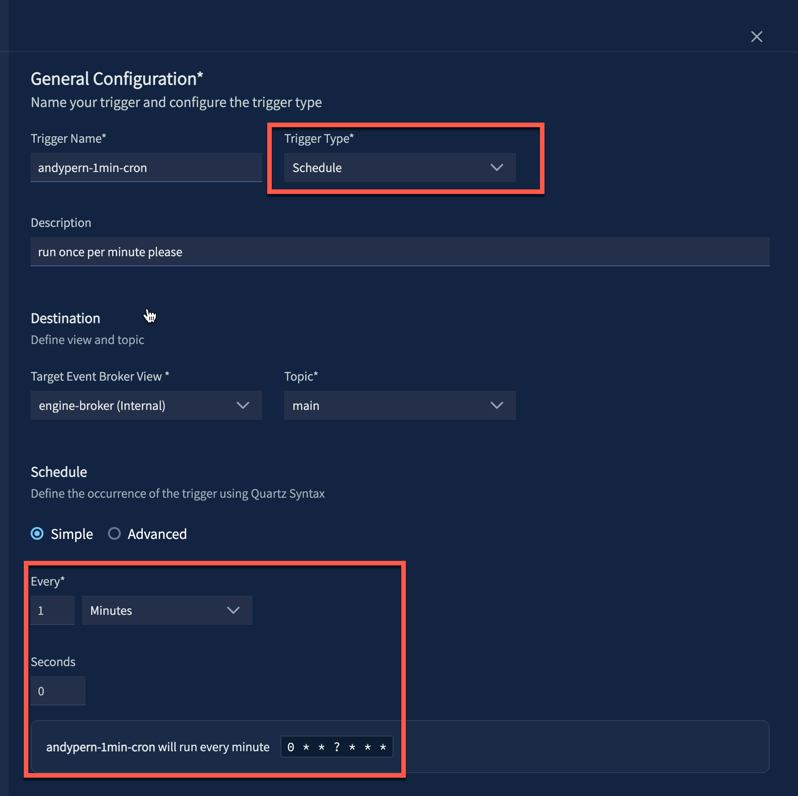

## Overview

A hello world function triggered on a cron schedule. Logs a greeting on initialization and the trigger event on each invocation.

| Field | Value |
|---|---|
| **Trigger** | Cron |
| **Runtime** | Python 3.12.12 |
| **Status** | In Progress |

## Prerequisites

- Access to a VAST DataEngine tenant and container registry (below as `<registry-host>`)
- `vastde` CLI installed and configured, see [DEVELOPMENT.md](../DEVELOPMENT.md)
  - run `vastde --version` to check installation
  - run `vastde functions list` to check that you have DataEngine access

## Project Structure
    |- main.py               # Your function handlers (init and handler)
    |- requirements.txt      # Python dependencies
    |- Aptfile               # System packages
    |- customDeps            # custom dependencies such as private common libraries
    |- config.example.yaml   # Environment variable template, copy to config.yaml and fill in values
    |- pipeline-config.yaml  # Pipeline definition (trigger → function wiring)
    |- README.md             # This file

## Configuration

Copy `config.example.yaml` to `config.yaml` and fill in your values:

```bash
cp config.example.yaml config.yaml
```

### Environment Variables

| Variable | Type | Description |
|---|---|---|
| `GREETING` | env | Message logged on each invocation |

Never commit `config.yaml`. It is already included in `.gitignore`.

## Run Function on DataEngine

Follow these steps to deploy and run the function on DataEngine. For detailed instructions, refer to the [DataEngine Documentation](https://kb.vastdata.com/documentation/docs/version-54-3).

Instructions are given using the `vastde` CLI and DataEngine UI.

> **Note:** Commands use `$USER` as a prefix for resource names (e.g. `$USER-hello-world`). This avoids naming collisions when multiple users are deploying to a shared tenant.

### 1. Build Function

Build the function image, then register it as a function in DataEngine:

```bash
cd python-cron-hello-world
vastde functions build $USER-hello-world
```

```bash
# vastde functions build output
Detected language: python
Validating Python version 3.12.*...
Python version 3.12.* resolved to 3.12.12
Building $USER-hello-world:latest
App Path: .../python-cron-hello-world
Handlers File: main.py
Build log: .../python-cron-hello-world/build.log
2026/03/18 14:22:18 [Started] Python Builder: $USER-hello-world:latest
2026/03/18 14:22:34 [Completed] Python Builder: $USER-hello-world:latest
Build completed: $USER-hello-world:latest
Build log saved to: .../python-cron-hello-world/build.log
```

Push the image to your container registry configured on your DataEngine tenant (search for `Container Registries` in VMS):

```bash
docker tag $USER-hello-world:latest <registry-host>/<registry-user>/$USER-hello-world:<version>
docker push <registry-host>/<registry-user>/$USER-hello-world:<version>
```

Create the function on DataEngine:
```bash
vastde functions create \
 --name $USER-hello-world \
 --container-registry <registry-name-on-vms> \
 --artifact-source <registry-user>/$USER-hello-world  \
 --image-tag <version>
```

```bash
# vastde functions create output
Function created: $USER-hello-world
Name: $USER-hello-world
Tags: []
GUID: <guid>
Owner: [id: <id>, id-type: vid]
Created At: 2026-03-18T18:50:47Z
Updated At: 2026-03-18T18:50:47Z
VRN: vast:dataengine:functions:$USER-hello-world
Last Revision: 1
```

### 2. Set up Trigger

To create the trigger, navigate to the DataEngine UI and click on `Triggers` + `Create Trigger`:



Fill in the following fields:

| Field | Example value | Notes |
|---|---|---|
| **Name** | `schedule-5m-trigger` | Must match the trigger name in `pipeline-config.yaml`. The pipeline create step will fail if the trigger does not exist or the name does not match |
| **Type** | `Schedule` | |
| **Cron Expression** | `0 0/5 * ? * * *` | Runs every 5 minutes |
| **Description** | `Schedule trigger - every 5 minutes` | Optional |

Afterwards, you can view the trigger via CLI:

```bash
vastde triggers list
```

```bash
# vastde triggers list output
Trigger Name               Status        Type        Description      GUID                        Updated at
------------------------------------------------------------------------------------------------------------------
schedule-20m-trigger       Ready         0xc0004...  Schedule tri...  6a9f2b3a-605d-4593-a90e...  2026-03-29 21:22
schedule-5m-trigger        Ready         0xc0006...                   4d32fd72-7961-4b00-940b...  2026-03-29 21:23
```

### 3. Deploy Pipeline

Create a pipeline connecting the trigger to the function using `pipeline-config.yaml`. 

> Before running, update the resource names in `pipeline-config.yaml` to include your `$USER` prefix:

```bash
vastde pipelines create --config pipeline-config.yaml
```

```bash
# vastde pipelines create output
Pipeline created: $USER-cron-hello-world-pipeline
Name: $USER-cron-hello-world-pipeline
Description: A sample pipeline to print hello world on a schedule
Tags: [cron]
GUID: df31058f-9e34-48f0-97ea-7222138e5bff
Owner: [id: 477, id-type: vid]
Created At: 2026-03-29T21:51:00Z
Updated At: 2026-03-29T21:51:00Z
VRN: vast:dataengine:pipelines:$USER-cron-hello-world-pipeline
```

You can deploy the pipeline via UI or CLI:

```bash
vastde pipelines deploy $USER-cron-hello-world-pipeline
```

```bash
# vastde pipelines deploy output
Pipeline deployed successfully
```

After the pipeline is deployed, tail the logs to verify the function is being invoked:

```bash
vastde logs tail $USER-cron-hello-world-pipeline --function $USER-hello-world --since 1h
```

```bash
# vastde logs tail output
2026-03-30 11:25:01.22 [$USER-hello-world] [INFO]  [user] Handler {'attributes': {'source': 'vastdata.com:schedule-5m-trigger.4d32fd72-7961-4b00-940b-e16383ee8a3f', 'id': '2d8ffd24-c69e-4ff6-8c29-6f4523991cbe', 'type': 'vastdata.com:Schedule.TimerElapsed', 'specversion': '1.0', 'time': '2026-03-30T15:25:00.837000+00:00', 'subject': 'engine-broker.main', 'datacontenttype': 'application/json', 'dataschema': None, 'cronschedule': '0 0/5 * ? * * *', 'knativekafkaoffset': '85992', 'knativekafkapartition': '0', 'partitionkey': '2d8ffd24-c69e-4ff6-8c29-6f4523991cbe', 'timerelapsedtimestamp': '2026-03-30T15:25:00.008211Z'}, 'data': {'message': 'Activating trigger by cron'}}
```

## Local Development

### Build

```bash
vastde functions build $USER-hello-world
```

### Run locally

```bash
vastde functions localrun $USER-hello-world -c config.yaml
```

### Invoke

```bash
vastde functions invoke --generate-event --url http://localhost:8080/
```

## Resources

- [DEVELOPMENT.md](../DEVELOPMENT.md): local setup and CLI workflow
- [CONTRIBUTING.md](../CONTRIBUTING.md): how to contribute
- [DataEngine Docs](https://kb.vastdata.com/documentation/docs/version-54-3)
- [DataEngine CLI](https://github.com/vast-data/dataengine-cli)
- [VAST Community](https://community.vastdata.com/)
- [VAST Developers](https://www.vastdata.com/developers)