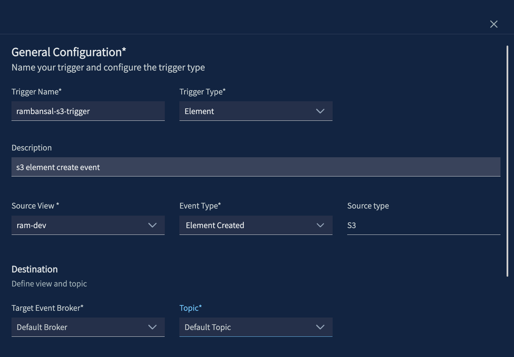

# python-s3-llm-summary

## Overview

An S3-triggered pipeline that reads uploaded files and returns an LLM-generated summary on each object creation event.

| Field | Value |
|---|---|
| **Trigger** | S3 Create Event  |
| **Runtime** | Python 3.12.12 |
| **Status** | Complete |

## Prerequisites

- Access to a VAST DataEngine tenant and container registry (below as `<registry-host>`)
- `vastde` CLI installed and configured, see [DEVELOPMENT.md](../DEVELOPMENT.md)
  - run `vastde --version` to check installation
  - run `vastde functions list` to check that you have DataEngine access
- An OpenAI-compatible LLM endpoint (local or remote)

## Project Structure
    |- main.py               # Function handlers with LLM toggle logic (local, remote, mock)
    |- requirements.txt      # Python dependencies
    |- Aptfile               # System packages
    |- customDeps            # Custom dependencies such as private common libraries
    |- config.example.yaml   # Environment variable template, copy to config.yaml and fill in values
    |- pipeline-config.yaml  # Pipeline definition (trigger → function wiring)
    |- README.md             # This file
    |- sample.txt            # Sample text file for local testing
    |- cloudevent.json       # Sample CloudEvent for local testing with `vastde functions invoke`
    |- secrets.example.yaml  # Secrets template, copy to secrets.yaml and fill in values

## Configuration

Copy `config.example.yaml` to `config.yaml` and fill in your values:

```bash
cp config.example.yaml config.yaml
```

Never commit `config.yaml`. It is already included in `.gitignore`.

### Environment Variables

| Variable | Required | Description |
|---|---|---|
| `S3_MOCK` | No | Set to `true` to use local `sample.txt` instead of real S3 (default: `false`) |
| `S3_ENDPOINT_URL` | When `S3_MOCK=false` | S3 endpoint URL (e.g. `http://s3.your-endpoint.com`) |
| `S3_REGION` | No | S3 region (e.g. `us-east-1`) |
| `LLM_MOCK` | No | Set to `false` to call a real LLM endpoint (default: `true`) |
| `LLM_ENDPOINT` | When `LLM_MOCK=false` | LLM base URL (e.g. `http://host.docker.internal:11434` or `https://api.openai.com`) |
| `MODEL_NAME` | When `LLM_MOCK=false` | Model name (e.g. `llama3.2`, `gpt-4o-mini`) |
| `MAX_TOKENS` | No | Max tokens for the LLM response (default: `512`) |

### Secrets

Copy `secrets.example.yaml` to `secrets.yaml` and fill in your values:

```bash
cp secrets.example.yaml secrets.yaml
```

Never commit `secrets.yaml`. It is already included in `.gitignore`.

| Secret | Required | Description |
|---|---|---|
| `S3_ACCESS_KEY` | When `S3_MOCK=false` | S3 access key |
| `S3_SECRET_KEY` | When `S3_MOCK=false` | S3 secret key |
| `LLM_API_KEY` | When `LLM_MOCK=false` | API key, optional for local endpoints and required for remote |

## Run Function on DataEngine

Follow these steps to deploy and run the function on DataEngine. For detailed instructions, refer to the [DataEngine Documentation](https://kb.vastdata.com/documentation/docs/version-54-3).

Instructions are given using the `vastde` CLI and DataEngine UI.

> **Note:** Commands use `$USER` (`echo $USER` value) as a prefix for resource names (e.g. `$USER-s3-llm-summary`). This avoids naming collisions when multiple users are deploying to a shared tenant. Also, consider using `${USER//./-}` instead of $USER to swap `.` with `-` for readability.

### 1. Build Function

Build the function image, then register it as a function in DataEngine:

```bash
cd python-s3-llm-summary
vastde functions build $USER-s3-llm-summary
```

```bash
# vastde functions build output
Detected language: python
Validating Python version 3.12.*...
Python version 3.12.* resolved to 3.12.12
Building $USER-s3-llm-summary:latest
App Path: .../python-s3-llm-summary
Handlers File: main.py
Build log: .../python-s3-llm-summary/build.log
2026/03/18 14:22:18 [Started] Python Builder: $USER-s3-llm-summary:latest
2026/03/18 14:22:34 [Completed] Python Builder: $USER-s3-llm-summary:latest
Build completed: $USER-s3-llm-summary:latest
Build log saved to: .../python-s3-llm-summary/build.log
```

Push the image to your container registry configured on your DataEngine tenant (search for `Container Registries` in VMS):

```bash
docker tag $USER-s3-llm-summary:latest <registry-host>/<registry-user>/$USER-s3-llm-summary:<version>
docker push <registry-host>/<registry-user>/$USER-s3-llm-summary:<version>
```

Create the function on DataEngine:
```bash
vastde functions create \
 --name $USER-s3-llm-summary \
 --container-registry <registry-name-on-vms> \
 --artifact-source <registry-user>/$USER-s3-llm-summary  \
 --image-tag <version>
```

```bash
# vastde functions create output
Function created: $USER-s3-llm-summary
Name: $USER-s3-llm-summary
Tags: []
GUID: <guid>
Owner: [id: <id>, id-type: vid]
Created At: 2026-03-18T18:50:47Z
Updated At: 2026-03-18T18:50:47Z
VRN: vast:dataengine:functions:$USER-s3-llm-summary
Last Revision: 1
```

List the available functions: `vastde functions list`:

```bash
# vastde functions list output
Function Name              Description                          Guid                                    Updated at         
---------------------------------------------------------------------------------------------------------------------------
$USER-s3-llm-summary                                           ca87e704-2501-4bc2-8ebe-aeba3ca7ed3f    2026-04-08 15:03 
```

### 2. Set up Trigger

To create the trigger, navigate to the DataEngine UI and click on `Triggers` + `Create Trigger`:



Fill in the following fields:

| Field | Example value | Notes |
|---|---|---|
| **Name** | `$USER-s3-llm-summary-trigger` | Replace $USER with `echo $USER` value. Must match the trigger name in `pipeline-config.yaml`. The pipeline create step will fail if the trigger does not exist or the name does not match |
| **Trigger Type** | `Element` | |
| **Source View** | `select s3 bucket` | We will use `s3cmd` to upload to the s3 bucket |
| **Element Type** | `Element Created` | |
| **Description** | `s3 element created event` | Optional |
<!-- | **Cron Expression** | `0 0/5 * ? * * *` | Runs every 5 minutes | -->

> **Note:** For `Source View`, ensure you have access to the S3 bucket for adding files to trigger pipeline.

Afterwards, you can view the trigger via CLI:

```bash
vastde triggers list
```

```bash
# vastde triggers list output
Trigger Name               Status        Type        Description      GUID                        Updated at
------------------------------------------------------------------------------------------------------------------
$USER-s3-llm-...-trigger   Ready         0xc0006...                   4d32fd72-7961-4b00-940b...  2026-03-29 21:23
schedule-20m-trigger       Ready         0xc0004...  Schedule tri...  6a9f2b3a-605d-4593-a90e...  2026-03-29 21:22
```

### 3. Deploy Pipeline

Create a pipeline connecting the trigger to the function using `pipeline-config.yaml`. 

> Before running, ensure the resource names in `pipeline-config.yaml` are updated (i.e. replace `$USER`):

```bash
vastde pipelines create --config pipeline-config.yaml
```

```bash
# vastde pipelines create output
Pipeline created: $USER-s3-llm-summary-pipeline
Name: $USER-s3-llm-summary-pipeline
Description: A sample pipeline to summarize body of text on a s3 element created event
Tags: [element-created]
GUID: df31058f-9e34-48f0-97ea-7222138e5bff
Owner: [id: 477, id-type: vid]
Created At: 2026-03-29T21:51:00Z
Updated At: 2026-03-29T21:51:00Z
VRN: vast:dataengine:pipelines:$USER-s3-llm-summary-pipeline
```

You can deploy the pipeline via UI or CLI:

```bash
vastde pipelines deploy $USER-s3-llm-summary-pipeline
```

```bash
# vastde pipelines deploy output
Pipeline deployed successfully
```

After the pipeline is deployed, tail the logs to verify the function is being invoked:

```bash
vastde logs tail $USER-s3-llm-summary-pipeline --function $USER-s3-llm-summary --since 1h
```


```bash
# vastde logs tail output
2026-04-19 16:46:26.70 [$USER-s3-llm-summary] [INFO]  [user] ℹ️ S3_MOCK=false
2026-04-19 16:46:26.70 [$USER-s3-llm-summary] [INFO]  [user] ✅ S3 client initialized
2026-04-19 16:46:26.70 [$USER-s3-llm-summary] [INFO]  [user] ℹ️ LLM_MOCK=true
2026-04-19 16:46:26.70 [$USER-s3-llm-summary] [INFO]  [user] ℹ️ LLM_MOCK=true, skipping LLM client init
```

### 4. Test Pipeline with S3 file upload

Confirm network access to the S3 bucket via `ping <S3 Endpoint>`.

Upload a text file to your S3 bucket to trigger the pipeline:

```bash
s3cmd put ./sample.txt s3://<your-bucket>/sample.txt
upload: './sample.txt' -> 's3://<your-bucket>/sample.txt'  [1 of 1]
done
```

Check the pipeline output:

```bash
vastde logs tail $USER-s3-llm-summary-pipeline --function $USER-s3-llm-summary --since 1h
```

```bash
# vastde logs tail output
2026-04-26 16:04:04.08 [$USER-s3-llm-summar...] [INFO]  [user] ℹ️ Handler invoked
2026-04-26 16:04:04.08 [$USER-s3-llm-summar...] [INFO]  [user] ℹ️ event.data={'Records': [{'eventVersion': '2.2', 'eventSource': 'vast:s3', 'awsRegion': 'selab-var-201', 'eventTime': '2026-04-26T18:47:12.113150Z', 'eventName': 'ObjectCreated:Put', 'userIdentity': {'principalId': '<id>'}, 'requestParameters': {'sourceIPAddress': '172.200.11.10'}, 'responseElements': {'x-amz-request-id': '0x4d15100003adf', 'x-amz-id-2': '0x4d15100003adf'}, 's3': {'s3SchemaVersion': '1.0', 'configurationId': '$USER-s3-llm-summary-trigger.c1e77e6e-881a-4635-b990-e606700add03', 'bucket': {'name': '$USER-dev', 'ownerIdentity': {'principalId': 'ram.bansal@selab.vastdata.com'}, 'arn': 'arn:aws:s3:::$USER-dev'}, 'object': {'key': 'sample25.txt', 'size': 1120, 'eTag': '77b32bf375f17f2bebdc481c1d8f21ea', 'sequencer': '00f100000000000f43a7'}}}]}
2026-04-26 16:04:04.08 [$USER-s3-llm-summar...] [INFO]  [user] 📦 Bucket: $USER-dev
2026-04-26 16:04:04.08 [$USER-s3-llm-summar...] [INFO]  [user] 📄 Key: sample25.txt
2026-04-26 16:04:04.08 [$USER-s3-llm-summar...] [INFO]  [user] ⬇️ Fetching file from S3...
2026-04-26 16:04:04.11 [$USER-s3-llm-summar...] [INFO]  [user] ✅ File fetched — size: 1120 bytes, type: text/plain
2026-04-26 16:04:04.11 [$USER-s3-llm-summar...] [INFO]  [user] 🤖 Calling LLM for summary...
2026-04-26 16:04:04.12 [$USER-s3-llm-summar...] [INFO]  [user] ℹ️ Model: nvidia/llama-3.1-8b-instruct, MaxTokens: 512
2026-04-26 16:04:29.63 [$USER-s3-llm-summar...] [INFO]  [user] ✅ Summary: The given text appears to be a passage of Lorem Ipsum, a filler text used for demonstration purposes in design and typography. It consists of two sections of descriptive text, describing various design elements and layouts.
```

## Local Development

### Build

```bash
vastde functions build $USER-s3-llm-summary
```

### Run locally

```bash
vastde functions localrun $USER-s3-llm-summary -c config.yaml
```

### Invoke

```bash
vastde functions invoke --generate-event --url http://localhost:8080/
```

```bash
# or with a custom event matching the DataEngine S3 trigger format:
vastde functions invoke --event ./cloudevent.json --url http://localhost:8080/
```

## Resources

- [DEVELOPMENT.md](../DEVELOPMENT.md): local setup and CLI workflow
- [CONTRIBUTING.md](../CONTRIBUTING.md): how to contribute
- [DataEngine Docs](https://kb.vastdata.com/documentation/docs/version-54-3)
- [DataEngine CLI](https://github.com/vast-data/dataengine-cli)
- [VAST Community](https://community.vastdata.com/)
- [VAST Developers](https://www.vastdata.com/developers)